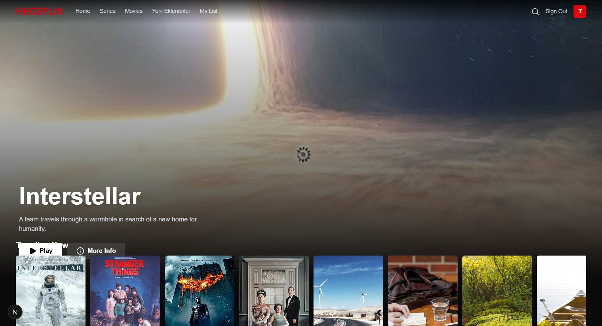
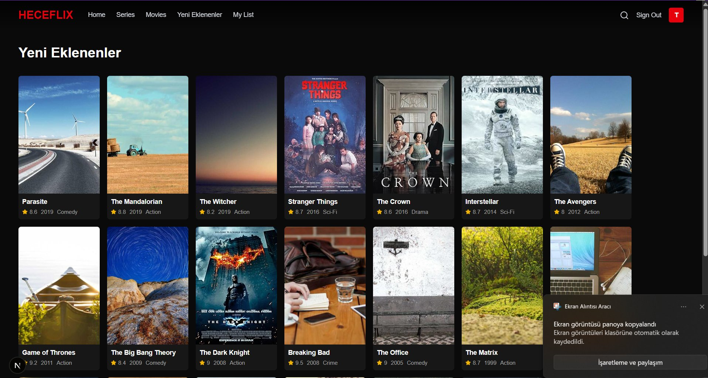
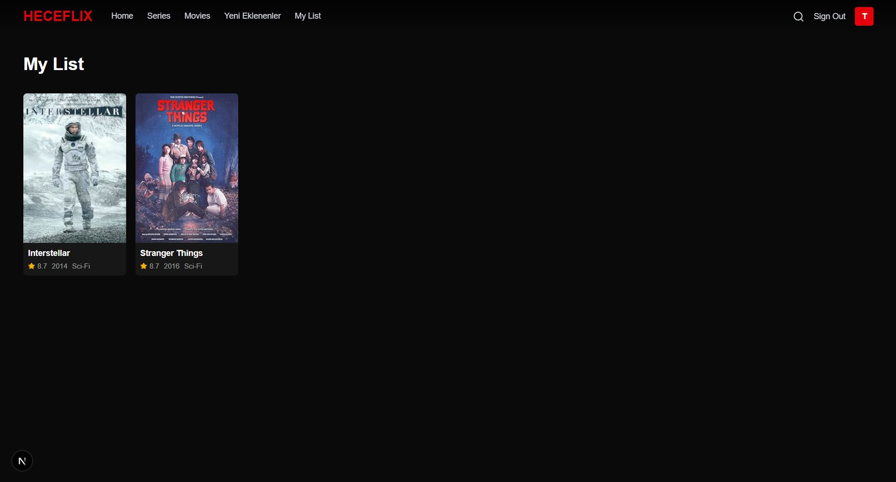

# 🎬 HECEFLIX — Netflix Benzeri Film/Dizi Platformu

🇹🇷 Türkçe | 🇬🇧 [English below](#-heceflix--netflix-like-movieseries-platform)

Next.js (App Router), TypeScript ve Tailwind CSS ile geliştirilmiş; duyarlı (responsive) ve tip güvenli bir film/dizi akış platformu arayüzü.

## 📸 Ekran Görüntüleri

**Ana Sayfa**



**Yeni Eklenenler**



**Listem**



## 🔑 Demo Giriş Bilgileri

| Alan | Değer |
| --- | --- |
| E-posta | `test@example.com` |
| Şifre | `123456` |

## 🚀 Kurulum ve Çalıştırma

### Gereksinimler

- Node.js **20.9 veya üzeri**
- npm

### Adımlar

```bash
# 1. Depoyu klonlayın
git clone https://github.com/KULLANICI-ADINIZ/REPO-ADINIZ.git
cd REPO-ADINIZ

# 2. Bağımlılıkları yükleyin
npm install

# 3. Geliştirme sunucusunu başlatın
npm run dev
```

Tarayıcıda [http://localhost:3000](http://localhost:3000) adresini açın ve yukarıdaki demo bilgileriyle giriş yapın.

Production derlemesi için:

```bash
npm run build
npm start
```

## ✨ Özellikler

### Temel Özellikler

- **Netflix benzeri tasarım:** Karanlık tema, hero banner, yatay kaydırılabilir kategori şeritleri, kırmızı HECEFLIX markası
- **Tam duyarlı (responsive) düzen:** Mobil hamburger menü, akışkan kart ızgaraları, tüm ekran boyutlarına uyum
- **Ana sayfa:** Öne çıkan içerikli hero bölümü + türlere göre içerik satırları
- **Navbar:** Ana Sayfa, Diziler, Filmler, **Yeni Eklenenler**, Listem bağlantıları; arama ikonu ve profil avatarı
- **İçerik kartları:** Poster, başlık, tür, yıl, puan ve hover'da Listem ekle/çıkar butonu
- **Detay sayfaları:** `/movie/:id` ve `/series/:id` dinamik rotaları; kayıtlı olmayan ya da yanlış türdeki id'ler için 404 (`notFound()`)
- **Arama:** Başlık, açıklama, tür ve oyuncu üzerinden arama; `?q=` URL parametresi desteği. Türkçe tür adları da çalışır (ör. **"bilim kurgu"** araması Sci-Fi içerikleri bulur)
- **Listem:** Ekleme/çıkarma, tekilleştirme, `localStorage` ile kalıcılık, tüm bileşenlerde anlık senkronizasyon (React Context)
- **Giriş:** Doğrulama, hata mesajı, başarılı girişte yönlendirme ve tüm sayfalarda rota koruması (route guard)
- **Temiz mimari:** `app / components / context / lib / data` katmanları; veri erişimi `ContentRepository` arayüzü üzerinden (repository pattern)

### Bonus Özellikler

- 🎞️ **Fragman modalı:** Detay sayfasındaki Play butonu, YouTube fragmanını oynatan bir video modalı açar (ESC veya arka plana tıklayarak kapanır)
- 💀 **Skeleton yükleme ekranları:** Listem, Arama ve sayfa geçişlerinde spinner yerine iskelet kartlar
- 🎛️ **Tür ve yıl filtreleri:** Filmler ve Diziler sayfalarında istemci taraflı filtreleme ve sonuç sayacı
- 🤝 **"Bunun Gibiler":** Detay sayfasında ortak türlere göre öneri satırı

## 🗺️ Rotalar

| Rota | Açıklama |
| --- | --- |
| `/` | Ana sayfa (hero + kategori satırları) |
| `/movie/:id` | Film detayı (id bir film değilse 404) |
| `/series/:id` | Dizi detayı (id bir dizi değilse 404) |
| `/movies` | Tüm filmler (tür/yıl filtreli) |
| `/series` | Tüm diziler (tür/yıl filtreli) |
| `/new` | Yeni Eklenenler (yıla göre en yeniden eskiye) |
| `/my-list` | Kişisel izleme listesi |
| `/search` | Arama |
| `/login` | Giriş |
| `/title/:id` | Eski rota — içeriğin türüne göre `/movie/:id` veya `/series/:id`'ye yönlendirir |

## 🛠️ Kullanılan Teknolojiler

- **Next.js 16** (App Router, Server Components)
- **React 19** + **TypeScript**
- **Tailwind CSS 4**
- **lucide-react** (ikonlar)

## 📁 Proje Yapısı

```
app/         → Sayfalar ve rotalar (App Router)
components/  → Yeniden kullanılabilir arayüz bileşenleri
context/     → Auth ve Listem için React Context sağlayıcıları
lib/         → Veri erişim katmanı (ContentRepository arayüzü + mock implementasyon)
data/        → Mock film/dizi kataloğu
```

---

# 🎬 HECEFLIX — Netflix-Like Movie/Series Platform

A responsive, type-safe movie/series streaming platform UI built with Next.js (App Router), TypeScript, and Tailwind CSS.

## 📸 Screenshots

**Home page**


**New Additions (Yeni Eklenenler)**


**My List**


## 🔑 Demo Credentials

| Field | Value |
| --- | --- |
| Email | `test@example.com` |
| Password | `123456` |

## 🚀 Getting Started

### Requirements

- Node.js **20.9 or newer**
- npm

### Steps

```bash
# 1. Clone the repository
git clone https://github.com/YOUR-USERNAME/YOUR-REPO.git
cd YOUR-REPO

# 2. Install dependencies
npm install

# 3. Start the development server
npm run dev
```

Open [http://localhost:3000](http://localhost:3000) in your browser and sign in with the demo credentials above.

For a production build:

```bash
npm run build
npm start
```

## ✨ Features

### Core Features

- **Netflix-like design:** Dark theme, hero banner, horizontally scrollable category rows, red HECEFLIX branding
- **Fully responsive layout:** Mobile hamburger menu, fluid card grids, adapts to all screen sizes
- **Home page:** Hero section with a featured title + genre-based content rows
- **Navbar:** Home, Series, Movies, **Yeni Eklenenler** (New Additions), My List links; search icon and profile avatar
- **Content cards:** Poster, title, genre, year, rating, and a hover add/remove My List button
- **Detail pages:** Dynamic `/movie/:id` and `/series/:id` routes; unknown or wrong-type ids return 404 via `notFound()`
- **Search:** Matches title, description, genre, and cast; supports `?q=` URL parameter. Turkish genre terms also work (e.g. searching **"bilim kurgu"** finds Sci-Fi titles)
- **My List:** Add/remove with deduplication, persisted in `localStorage`, synced across components via React Context
- **Login:** Validation, error message, redirect on success, and a route guard protecting every page
- **Clean architecture:** `app / components / context / lib / data` layers; data access goes through a `ContentRepository` interface (repository pattern)

### Bonus Features

- 🎞️ **Trailer modal:** The Play button on detail pages opens a video modal playing the YouTube trailer (closes on ESC or backdrop click)
- 💀 **Skeleton loading states:** My List, Search, and route transitions show skeleton cards instead of spinners
- 🎛️ **Genre & year filters:** Client-side filtering with a result counter on the Movies and Series pages
- 🤝 **"More Like This":** Recommendation row on detail pages based on shared genres

## 🗺️ Routes

| Route | Description |
| --- | --- |
| `/` | Home (hero + category rows) |
| `/movie/:id` | Movie detail (404 if the id is not a movie) |
| `/series/:id` | Series detail (404 if the id is not a series) |
| `/movies` | All movies (with genre/year filters) |
| `/series` | All series (with genre/year filters) |
| `/new` | New additions (newest first by year) |
| `/my-list` | Personal watchlist |
| `/search` | Search |
| `/login` | Sign in |
| `/title/:id` | Legacy route — redirects to `/movie/:id` or `/series/:id` based on content type |

## 🛠️ Tech Stack

- **Next.js 16** (App Router, Server Components)
- **React 19** + **TypeScript**
- **Tailwind CSS 4**
- **lucide-react** (icons)

## 📁 Project Structure

```
app/         → Pages and routes (App Router)
components/  → Reusable UI components
context/     → React Context providers for Auth and My List
lib/         → Data access layer (ContentRepository interface + mock implementation)
data/        → Mock movie/series catalog
```
